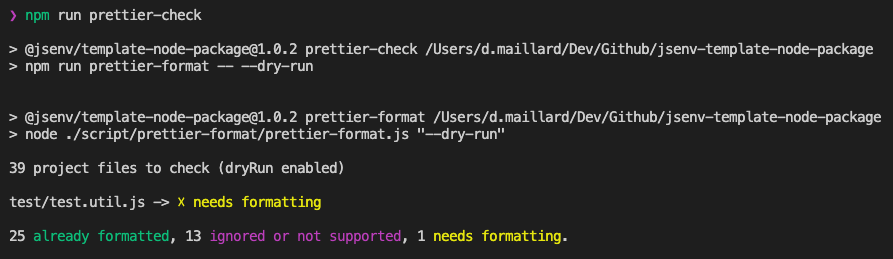
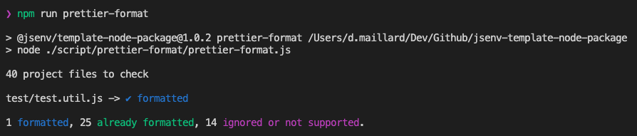
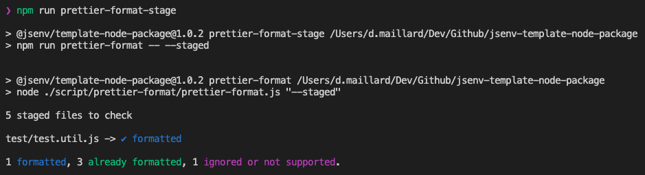

# Formatting

The codebase uses [prettier](https://prettier.io) to ensure files formatting is consistent and pretty.

If you want to keep prettier, check [How to use Prettier](#How-to-use-prettier). Otherwise see [How to remove prettier](#How-to-remove-prettier).

# How to use prettier

The prettier configuration can be found in [.prettierrc.yml](../../.prettierrc.yml).

Install [prettier-vscode](https://marketplace.visualstudio.com/items?itemName=esbenp.prettier-vscode) and **let the extension do the formatting** when you save a file.

This repository has pre-configured some commands related to prettier:

| Command                       | Description                                                                                        | Screenshot                                     |
| ----------------------------- | -------------------------------------------------------------------------------------------------- | ---------------------------------------------- |
| npm run prettier-check        | Log files matching and not matching prettier format                                                |         |
| npm run prettier-format       | Format all files in the project                                                                    |        |
| npm run prettier-format-stage | Format all files in the [git staging area](https://softwareengineering.stackexchange.com/a/119790) |  |

# How to remove prettier

1. Remove prettier scripts from `"scripts"` in [package.json](../../package.json#L47)
2. Delete [script/prettier/](../../script/prettier/) directory
3. Delete [.prettierignore](../../.prettierignore)
4. Delete [.prettierrc.yml](../../.prettierrc.yml)
5. Remove `"@jsenv/prettier-check-project"` and `"prettier"` from `"devDependencies"` in [package.json](../../package.json#L63)
