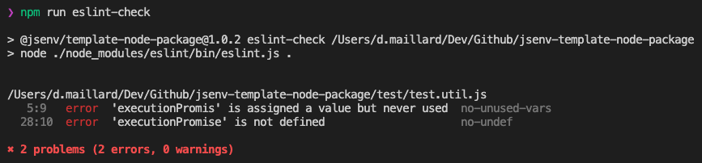

# Linting

The codebase uses [ESLint](https://eslint.org) to lint files.

If ESLint rules are not respected, the main GitHub **workflow will fail** during [check lint step](../../.github/workflows/main.yml#L47).

If you want to keep ESLint, check [How to use ESLint](#How-to-use-eslint). Otherwise see [How to remove ESLint](#How-to-remove-eslint).

# How to use ESLint

The ESLint configuration can be found in [.eslintrc.cjs](../../.eslintrc.cjs).

It is recommended to install and use [vscode-eslint](https://marketplace.visualstudio.com/items?itemName=dbaeumer.vscode-eslint) to have **ESLint integrated in VSCode**.

To execute ESLint on all files use the following command: `npm run eslint-check`

# How to remove ESLint

1. Remove `check lint` step in [.github/workflows/main.yml](../../.github/workflows/main.yml#L47)
2. Remove `"eslint-check"` from `"scripts"` in [package.json](../../package.json#L47)
3. Delete [.eslintrc.cjs](../../.eslintrc.cjs)
4. Delete [.eslintignore](../../.eslintignore)
5. Remove these `"devDependencies"` in [package.json](../../package.json#L63)

   - `"@jsenv/eslint-config"`
   - `"@jsenv/importmap-eslint-resolver"`
   - `"eslint-plugin-import"`
   - `"eslint"`
