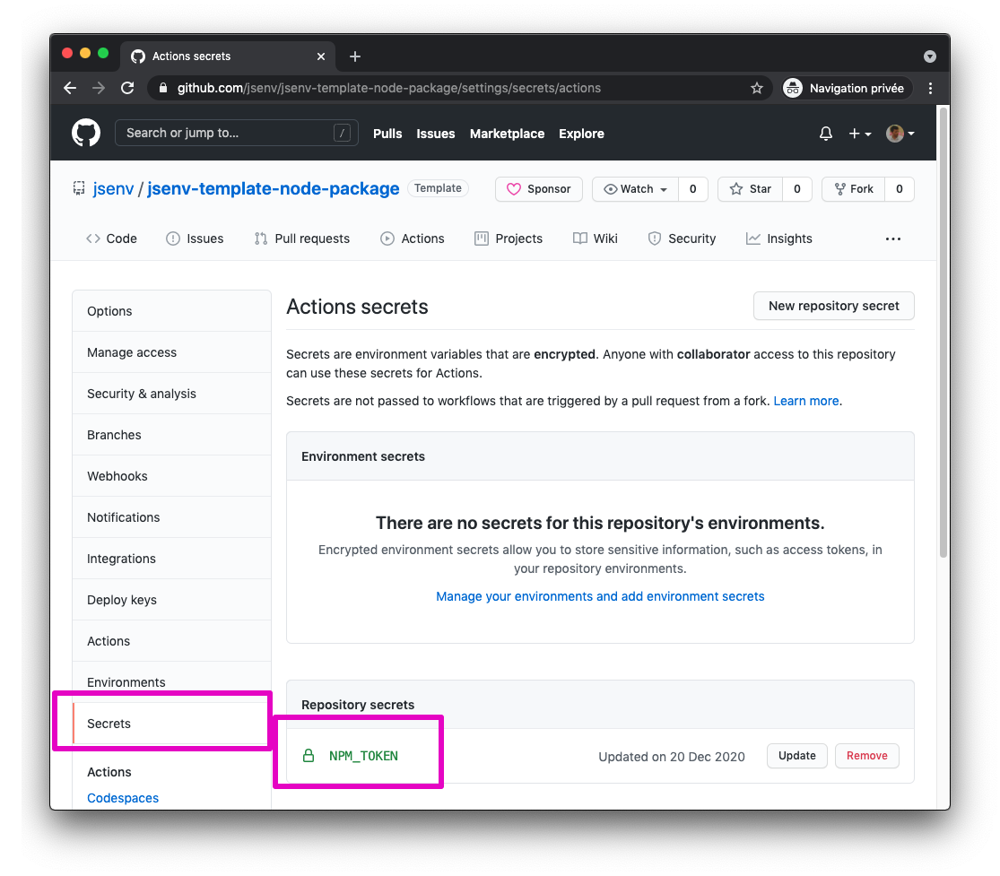

# Publishing

This repository is publishing a package on npm. It is visible at https://www.npmjs.com/package/@jsenv/template-node-package.

To update the package on npm, use `npm publish`.

The package is also published **automatically** during the main GitHub workflow under certain circumstances. Read more in [Auto publish on npm](#Auto-publish-on-npm)

# Auto publish on npm

This behaviour could be translated into the following sentence:

_When `"version"` in package.json on the main branch is not published and if tests are passing, then publish this new version._

As a package author, I was sick of running _npm publish_ several times per day. Then, I discovered continuous delivery workflow where code is deployed to production by pushing to the _prod_ branch.

Putting side by side "I am tired of running this everyday" and continuous delivery I realized that publishing a package to a registry is like pushing code to production. So it could and should be automated.

As a bonus, it makes it possible to publish package on multiple registries at once (npm + github for example). You just have to add the registry url and token in [.github/workflows/main/publish_package.mjs](../../.github/workflows/main/publish_package.mjs)

```diff
  "https://registry.npmjs.org": {
    token: process.env.NPM_TOKEN,
  },
+  "https://npm.pkg.github.com": {
+    token: process.env.GITHUB_TOKEN,
+  }
```

To keep auto publish on npm, check [How to use auto publish](#how-to-use-auto-publish). Otherwise see [How to remove auto publish](#how-to-remove-auto-publish).

## How to use auto publish

It is implemented by `publish package` in [.github/workflows/main.yml](../../.github/workflows/main.yml#66).

The code responsible to publish the package on npm is [.github/workflows/main/publish_package.mjs](../../.github/workflows/main/publish_package.mjs). As explained, if the package registry already got this package version this code will not publish anything.

To enable this feature you need to:

1. Create an access token for npm

   Documented on npm in [Creating and viewing access tokens](https://docs.npmjs.com/creating-and-viewing-access-tokens)

2. Add the npm token to the GitHub repository secrets

   Documented on GitHub in [Creating encrypted secrets for a repository](https://docs.github.com/en/actions/reference/encrypted-secrets#creating-encrypted-secrets-for-a-repository).

   The secret name must be `NPM_TOKEN` or you need to update `secrets.NPM_TOKEN` in [.github/workflows/main.yml](../../.github/workflows/main.yml#L69)

   

</details>

## How to remove auto publish

1. Remove `publish package` in [.github/workflows/main.yml](../../.github/workflows/main.yml#66).
2. Delete [.github/workflows/main/publish_package.ms](../../.github/workflows/main/publish_package.mjs)
3. Remove `"@jsenv/package-publish"` from `"devDependencies"` in [package.json](../../package.json#L63)
