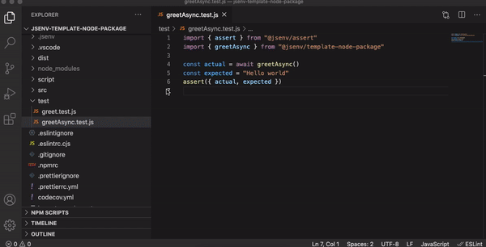
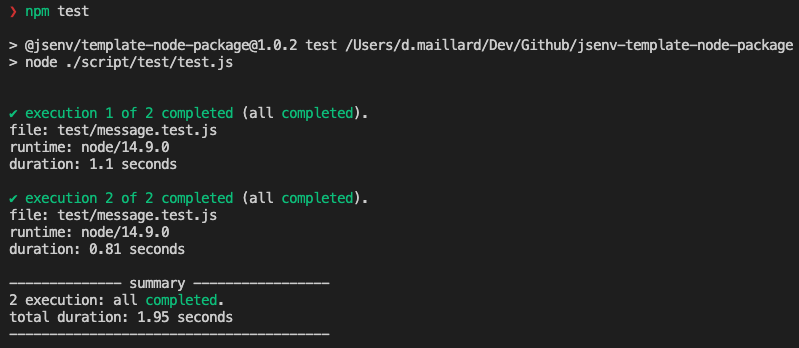

<!-- https://github.com/github/docs/blob/main/tests/README.md -->

# Testing

All test files are inside the [test/](./test/) directory and ends with `.test.mjs`.

If one or more test is failing, the main GitHub **workflow will fail** during [check tests](../../.github/workflows/main.yml#L49) step.

Code coverage from test files is monitored, this is documented in [docs/coverage/coverage.md](../coverage/coverage.md#coverage).

If you want to keep test files check [How to use tests](#How-to-use-tests). Otherwise see [How to remove tests](#How-to-remove-tests).

# How to use tests

Test files are written using jsenv philosophy: **A test file can be executed with the `node` command**.

```console
> node ./test/message.test.mjs
passed
```

See [test/message.test.mjs](../../test/message.test.mjs)

## Debug a test

As previously mentioned, according to jsenv philosophy a test file executes like a classic file. It means you can use the debugging tool of classic files to debug test files.

The recommended way to debug a file is to use VSCode integrated debugger for Node.js.



See also

- VSCode debugger documentation: https://code.visualstudio.com/docs/nodejs/nodejs-debugging.
- Node.js debugging recipe: https://nodejs.org/en/docs/guides/debugging-getting-started

## Executing all tests

Use `npm test` command. It is configured to execute [script/test/test.mjs](../../script/test/test.mjs) which is responsible to find and execute all your test files.

Test files are executed twice, the second execution ensure code specific to _production_ is also tested.



# How to remove tests

If you don't need test or want to use an other test framework/library follow the steps below.

1. Remove `check tests` step in [.github/workflows/main.yml](../../.github/workflows/main.yml#L49)
2. Remove `"test"` and `"test-with-coverage"` from `"scripts"` in [package.json](../../package.json#L47)
3. Delete [script/test/](../../script/test/) directory
4. Remove `"@jsenv/assert"` from `"devDependencies"` [package.json](../../package.json#L64)
